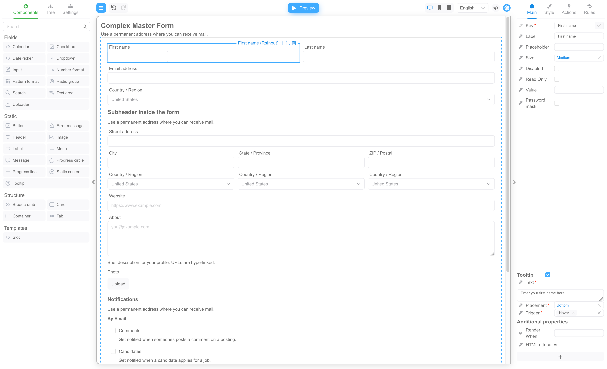

# React Form Builder example application

React Form Builder is a Drag & Drop Form Builder library for React.

Develop front-end drag and drop forms with ease, resulting in cost savings and reduced development timing

## How to start

```bash
npm install
npm run start
```

## Features

1. Web interface with Drag & Drop functionality.
2. Adaptive layout.
3. Form validation.
4. Built-in web components based on React Suite library.
5. Easy integration of custom components.
6. Export form to JSON and import form from JSON.
7. Powerful internationalization.
8. Custom actions.
9. Computable properties.
10. Templates (forms within a form).

## Screenshots

[](https://demo.formengine.io)

[](https://demo.formengine.io)

## Information

- Website - [formengine.io](https://formengine.io).
- Demo - [demo.formengine.io](https://demo.formengine.io).
- Documentation - [formengine.io/documentation](https://formengine.io/documentation).

For commercial use, please contact [sales@optimajet.com](mailto:sales@optimajet.com).
