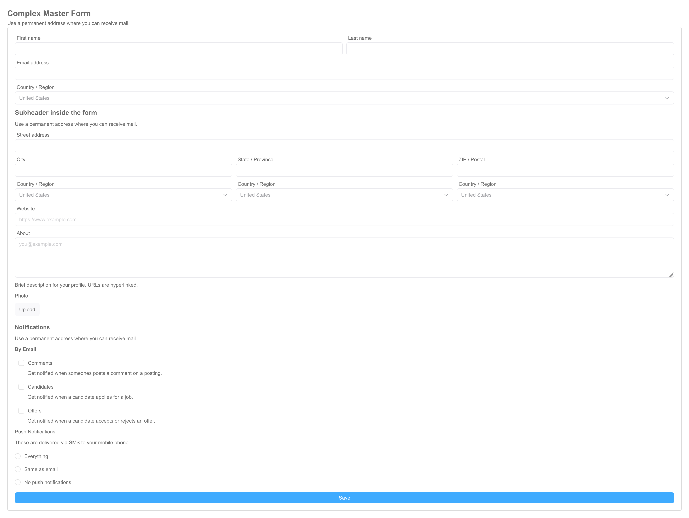

# Optimajet FormEngine Community

## Overview

**FormEngine Community**
A free,
open-source solution for building forms in React with code that is straightforward—even for developers who are not front-end specialists.
Similar to React Hook Form, it lowers the entry barrier for creating complex React forms while offering more features out of the box,
including event handling, computed fields, validation, localization, and a ready-to-use component library.

## Key Features

- **UI-Agnostic Components:** Works seamlessly with any UI
  library ([MUI](https://mui.com/), [Ant Design](https://ant.design/), [shadcn/ui](https://ui.shadcn.com/)
  and [others](https://formengine.io/documentation/custom-components))
- **Pre-Built React Suite Integration:** Includes a ready-to-use component
  library – [@react-form-builder/components-rsuite](https://www.npmjs.com/package/@react-form-builder/components-rsuite).
- Framework Support:
  - **Next.js Integration**: Seamlessly works with [Next.js](https://formengine.io/documentation/usage-with-nextjs).
  - **Remix Compatibility**: Fully supports [Remix](https://formengine.io/documentation/usage-with-remix).
  - **Framework-Agnostic**: Can also be used [without any framework](https://formengine.io/documentation/installation#cdn) via CDN.
- **Multi-Database Support:** Compatible with MySQL, PostgreSQL, MongoDB, SQLite, and more.
- **Built-in Validation with Zod:** Includes pre-configured validation rules powered by [Zod](https://github.com/colinhacks/zod).
- **Extensible Validation Support:** Works
  with [Yup](https://github.com/jquense/yup), [AJV](https://github.com/ajv-validator/ajv), [Zod](https://github.com/colinhacks/zod),
  [Superstruct](https://github.com/ianstormtaylor/superstruct),
  [Joi](https://github.com/hapijs/joi), and other custom validation libraries.
- **Responsive Layouts**: Build forms that automatically [adapt](https://formengine.io/documentation/adaptive-layout) to all screen sizes.
- **Custom Actions**: Enhance forms with interactive logic through [custom JavaScript code](https://formengine.io/documentation/actions).
- **Dynamic Properties**: Implement real-time component changes with [MobX](https://github.com/mobxjs/mobx)-powered reactive properties.
- **Flexible Storage Options**:
  - Store complete form definitions as JSON.
  - Programmatically generate forms [via code](https://formengine.io/documentation/building-forms-via-code).

## Documentation

[Documentation website](https://formengine.io/documentation)

## How to start

```bash
git clone git@github.com:optimajet/formengine.git
cd formengine/community/src
npm install
npm run start
```

## FormEngine Community packages

<table>
  <thead>
  <tr>
    <th>Package</th>
    <th>Badges</th>
    <th>Description</th>
  </tr>
  </thead>
  <tbody>
  <tr>
    <td>
      <a href="https://www.npmjs.com/package/@react-form-builder/core">@react-form-builder/core</a>
    </td>
    <td>
      <a href="https://www.npmjs.com/package/@react-form-builder/core">
        </a>
      
    </td>
    <td>The main package responsible for rendering forms.</td>
  </tr>
  <tr>
    <td>
      <a href="https://www.npmjs.com/package/@react-form-builder/components-rsuite">@react-form-builder/components-rsuite</a>
    </td>
    <td>
      <a href="https://www.npmjs.com/package/@react-form-builder/components-rsuite">
        </a>
      
    </td>
    <td>The package with visual components based on <a href="https://rsuitejs.com/">React Suite</a>.</td>
  </tr>
  <tr>
    <td>
      <a href="https://www.npmjs.com/package/@react-form-builder/viewer-bundle">@react-form-builder/viewer-bundle</a>
    </td>
    <td>
      <a href="https://www.npmjs.com/package/@react-form-builder/viewer-bundle">
        </a>
      
    </td>
    <td>The <code>@react-form-builder/core</code> and <code>@react-form-builder/components-rsuite</code> packages built for use on an HTML
      page without React.
    </td>
  </tr>
  </tbody>
</table>

## Screenshots

[](https://demo.formengine.io)
